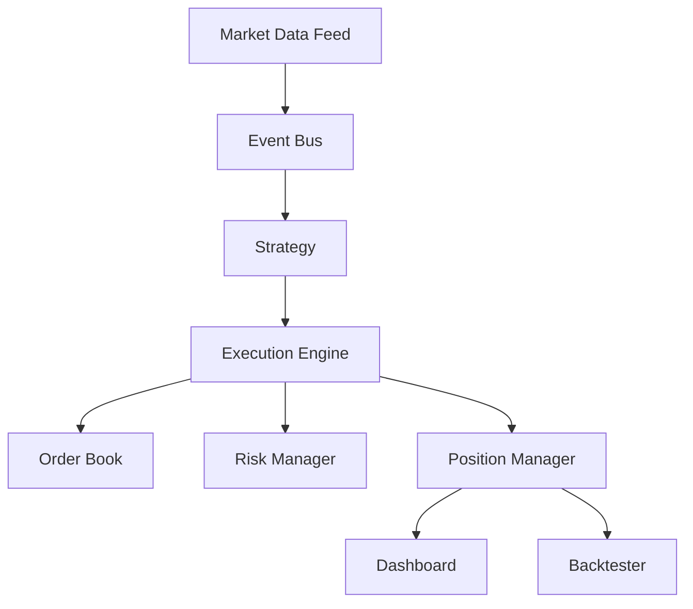

# Event-Driven Trading Engine

**A modular quantitative trading system built from scratch in Python**


---

## Quick Start

```bash
# Clone and setup
git clone https://github.com/Patience-Fuglo/trading-engine.git
cd trading-engine
python -m venv .venv && source .venv/bin/activate
pip install -r requirements.txt

# Run tests
pytest -q

# Run backtest demo
python tests/test_backtester.py

# Run dashboard demo
python tests/test_dashboard.py
```

---

## Overview

This project implements an **event-driven trading engine from scratch**, demonstrating the core architecture used in quantitative trading systems.

**Core Components:**

| Module | Description |
|--------|-------------|
| Event Bus | Decoupled pub/sub communication between components |
| Order Book | Price-time priority matching engine |
| Execution Engine | Order lifecycle management and routing |
| Risk Manager | Pre-trade position and exposure checks |
| Position Manager | Real-time P&L and holdings tracking |
| Backtester | Historical strategy simulation with metrics |
| Dashboard | Terminal UI for live monitoring |

The design emphasizes **modularity**—each component operates independently while communicating through events, mirroring production trading system architecture.

---

## System Architecture

The system follows an **event-driven architecture** where each component communicates through events rather than direct coupling.

```
Market Data Feed
       ↓
     Event Bus
       ↓
     Strategy
       ↓
  Execution Engine
       ↓
    Order Book
       ↓
   Risk Manager
       ↓
 Position Manager
       ↓
 Dashboard / Backtester
```

Each module can be extended or replaced without changing the entire system.

Mermaid diagram:



---

## Features

* Event-driven trading system architecture
* Simulated order book with price priority matching
* Risk management guardrails
* Execution engine connecting all system components
* Position tracking with realized and unrealized P&L
* Historical strategy backtesting framework
* Terminal-based monitoring dashboard
* Modular design suitable for extension

---

## Project Modules

### 1. Event System

Provides communication between independent components.

Files:

```
events.py
event_bus.py
```

Core pattern:

```
publish(event)
subscribe(event)
```

Events allow different parts of the system to react to updates such as market data or order fills.

---

### 2. Order Book

Stores buy and sell orders waiting to be matched.

Files:

```
order.py
order_book.py
```

Order priority:

```
BUY orders  → highest price first
SELL orders → lowest price first
```

Matching occurs when:

```
best_bid >= best_ask
```

---

### 3. Position & PnL Tracking

Tracks portfolio holdings and profit/loss.

Files:

```
position.py
position_manager.py
```

Tracks:

* quantity
* average entry price
* realized P&L
* unrealized P&L

Portfolio value:

```
cash + position_quantity × current_price
```

---

### 4. Risk Manager

Applies safety checks before orders are executed.

File:

```
risk_manager.py
```

Risk controls implemented:

* Maximum position size
* Maximum portfolio exposure
* Maximum daily loss

Orders that fail these checks are rejected before execution.

---

### 5. Execution Engine

Central component that connects the system.

File:

```
execution_engine.py
```

Execution workflow:

```
Submit Order
      ↓
Risk Check
      ↓
Add to Order Book
      ↓
Match Orders
      ↓
Update Positions
      ↓
Publish Events
```

Order states include:

```
ACTIVE
PARTIALLY_FILLED
FILLED
REJECTED
```

---

### 6. Market Data Feed

Simulates a live data feed using historical CSV data.

File:

```
market_data.py
```

CSV format:

```
symbol,timestamp,open,high,low,close,volume
```

Data flow:

```
Load CSV
    ↓
Publish MarketDataEvent
    ↓
Update latest prices
    ↓
Store price history
```

---

### 7. Strategy & Backtester

Provides a framework for testing trading strategies on historical data.

Files:

```
strategy.py
backtester.py
```

Example strategy implemented:

```
Moving Average Crossover
```

Logic:

```
Short MA > Long MA → BUY
Short MA < Long MA → SELL
```

Backtester tracks:

* portfolio value
* number of trades
* total return
* transaction fees
* maximum drawdown

Example strategy implementation:

```python
class MovingAverageCrossover(Strategy):
    def __init__(self, short_window=5, long_window=20):
        self.short_window = short_window
        self.long_window = long_window
        self.prices = []
        self.previous_signal = None

    def on_market_data(self, symbol, price, timestamp):
        self.prices.append(price)
        
        if len(self.prices) < self.long_window:
            return None
        
        short_ma = sum(self.prices[-self.short_window:]) / self.short_window
        long_ma = sum(self.prices[-self.long_window:]) / self.long_window
        
        if short_ma > long_ma:
            return Order(symbol=symbol, side="BUY", quantity=10)
        elif short_ma < long_ma:
            return Order(symbol=symbol, side="SELL", quantity=10)
```

The strategy receives market data events, calculates moving averages, and generates buy/sell signals that flow through the execution engine.

---

### 8. Monitoring Dashboard

Provides a terminal-based interface to monitor the system.

File:

```
dashboard.py
```

Built using the **Rich** library.

Displays:

* current positions
* recent orders
* realized and unrealized P&L
* risk exposure indicators

---

## Project Structure

```
trading_engine/
    events.py
    event_bus.py
    order.py
    order_book.py
    position.py
    position_manager.py
    risk_manager.py
    execution_engine.py
    market_data.py
    strategy.py
    backtester.py
    dashboard.py
    __init__.py

tests/
    test_event.py
    test_order_book.py
    test_position.py
    test_positions.py
    test_risk_manager.py
    test_execution_engine.py
    test_market_data.py
    test_backtester.py
    test_dashboard.py

data/
    sample_orders.csv
    sample_prices.csv

.github/
    workflows/
        ci.yml

README.md
LICENSE
pyproject.toml
requirements.txt
```


## Requirements

Python 3.10+

Install dependencies:

```bash
pip install -r requirements.txt
```

Or install as an editable package:

```bash
pip install -e .[dev]
```

---

## Running the Project

Run the test suite:

```bash
pytest -q
```

Run from a clean environment:

```bash
python -m venv .venv
source .venv/bin/activate
pip install -r requirements.txt
pytest -q
```

Optional demo scripts:

```
python tests/test_event.py
python tests/test_order_book.py
python tests/test_position.py
python tests/test_risk_manager.py
python tests/test_execution_engine.py
python tests/test_market_data.py
python tests/test_backtester.py
python tests/test_dashboard.py
```

The pytest suite provides assertion-based checks; the script files above provide interactive component walkthroughs.

---

## Sample Output

### Backtester Results

```bash
$ python tests/test_backtester.py
```
```
Backtest Report
------------------------------
Starting Cash: $100,000.00
Ending Value: $101,986.29
Total Return: 1.99%
Number of Trades: 4
Total Fees Paid: $7.71
Max Drawdown: 0.01%
```

### Dashboard Output

```bash
$ python tests/test_dashboard.py
```
```
Trading Engine Dashboard - 2024-01-15 09:30:00

                                   Positions                                    
┏━━━━━━━━┳━━━━━━━━━━┳━━━━━━━━━━━┳━━━━━━━━━━━━━━━┳━━━━━━━━━━━━━━━┳━━━━━━━━━━━━━━┓
┃ Symbol ┃ Quantity ┃ Avg Price ┃ Current Price ┃ Unrealized    ┃ Realized P&L ┃
┡━━━━━━━━╇━━━━━━━━━━╇━━━━━━━━━━━╇━━━━━━━━━━━━━━━╇━━━━━━━━━━━━━━━╇━━━━━━━━━━━━━━┩
│ AAPL   │ 80       │ 150.00    │ 155.00        │ 400.00        │ 200.00       │
│ MSFT   │ 50       │ 340.00    │ 350.00        │ 500.00        │ 0.00         │
│ GOOGL  │ 30       │ 130.00    │ 135.00        │ 150.00        │ 0.00         │
└────────┴──────────┴───────────┴───────────────┴───────────────┴──────────────┘
                        Recent Orders                         
┏━━━━━━━━━━┳━━━━━━━━┳━━━━━━┳━━━━━┳━━━━━━━━┳━━━━━━━━━━━━━━━━━━┓
┃ Order ID ┃ Symbol ┃ Side ┃ Qty ┃ Price  ┃ Status           ┃
┡━━━━━━━━━━╇━━━━━━━━╇━━━━━━╇━━━━━╇━━━━━━━━╇━━━━━━━━━━━━━━━━━━┩
│ ORD001   │ AAPL   │ BUY  │ 100 │ 150.00 │ FILLED           │
│ ORD002   │ MSFT   │ SELL │ 50  │ 350.00 │ PARTIALLY_FILLED │
│ ORD003   │ GOOGL  │ BUY  │ 30  │ 130.00 │ ACTIVE           │
└──────────┴────────┴──────┴─────┴────────┴──────────────────┘

Risk Status
Position Usage : █------------------- 8.0%
Exposure Usage : ██████-------------- 34.0%
Daily Loss Use : ████---------------- 24.0%
```

### Execution Engine Events

```bash
$ python tests/test_execution_engine.py
```
```
Event: OrderSubmitted | Data: {'order_id': 'SELL001', 'symbol': 'AAPL', ...}
Event: OrderSubmitted | Data: {'order_id': 'BUY001', 'symbol': 'AAPL', ...}
Event: OrderFilled | Data: {'buyer_order_id': 'BUY001', 'seller_order_id': 'SELL001', 'fill_price': 150.0, 'fill_quantity': 50}

Final Order Status:
Sell Order: PARTIALLY_FILLED | Remaining Qty: 50
Buy Order: FILLED | Remaining Qty: 0
```

---

## Test Suite

All tests passing:

```bash
$ pytest -q
.....                                                    [100%]
5 passed
```

CI runs automatically on push and pull requests via GitHub Actions.

This project prioritizes **architecture clarity** over latency optimization.

---

## Technologies

* Python
* Event-driven architecture
* CSV data feeds
* Rich (terminal UI library)

---

## Key Concepts Demonstrated

* Event-driven system design
* Order book mechanics
* Risk management frameworks
* Position accounting
* Strategy signal generation
* Historical backtesting
* Trading system monitoring

---

## How This Architecture Can Be Extended

Possible extensions include:

* multi-symbol strategy support
* asynchronous event processing
* database storage
* exchange API integration
* slippage and transaction cost modeling
* portfolio optimization
* real-time dashboards

---

## Future Improvements

Potential next steps:

1. Multi-asset and multi-symbol portfolio accounting
2. Slippage/market-impact execution model
3. Persistent storage for orders/fills/positions
4. Parameterized strategy experiments with result tracking
5. Async event processing and external market data adapters

---

## License

MIT License. See [LICENSE](LICENSE) for details.

---

## Disclaimer

This is an educational implementation demonstrating trading system architecture. Not intended for live trading without significant additional development and testing.
